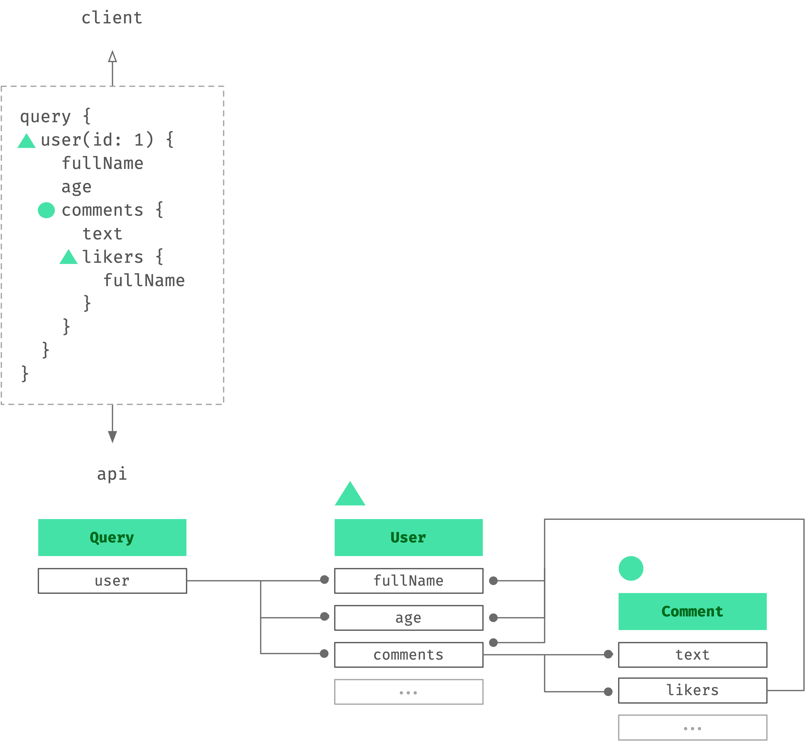
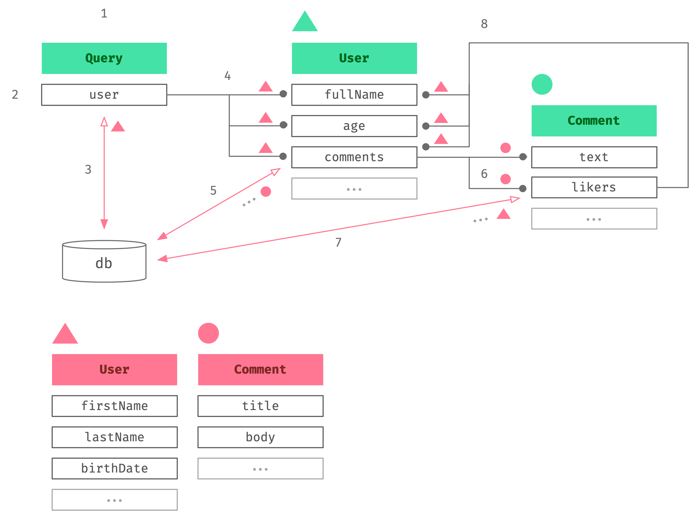

# Schema

## Introduction

###### Importing

You will use the schema component of Nexus to build your GraphQL schema. You can import it as a named export from the main module of the `nexus-future` package. If you prefer you can also import the default `app` export and then access the `schema` property.

<!-- prettier-ignore -->
```ts
import app from 'nexus-future'        // default style
import { schema } from 'nexus-future' // named-export style

app.schema === schema // true
```

<p class="NextIs Tip"></p>

> Leverage [VSCode auto-import](https://code.visualstudio.com/docs/languages/typescript#_auto-imports). Anywhere in a TypeScript module in your project type either `app` to summon auto-import for the default style or `schema` for named-export style.

###### Singleton & Mutation

The schema component is part of the app singleton and usage of its methods affects the overall app state. While this is not a functionally pure approach it does allow you to use its methods throughout your project without having to think about exporting/importing values. One of Nexus' design goals is to approach the ease and readability of [GraphQL SDL](https://www.prisma.io/blog/graphql-sdl-schema-definition-language-6755bcb9ce51) where we can. This is one example of doing that.

As an example, the following snippet shows the addition of an object type to the GraphQL schema. Notice how the return value is not used in any way. The method is actually mutating the app state.

```ts
import { schema } from 'nexus-future'

schema.objectType({
  name: 'Foo',
  definition(t) {
    t.string('bar', () => 'qux')
  },
})
```

## Data Graph

As the API author, there are three design tasks you will invariable perform over and over again:

1. Create data types that model logical entities and concepts in your business domain.
2. Define connections between these data types that model how logical entities and concepts relate in your business domain.
3. Define entrypoints which allow traversal into this graph of data.

This is an iterative process that can generally be seen as an finite loop wherein your team gradually refines and expands (or contracts!) the data graph as you respond to changing client app needs, business needs, and so on. Data modelling is hard work. For one thing it is a suble art, occasionally underappreciated. There are typically multiple ways to model any one thing and competing tradeoffs that leave no obvious winner abound. If the process of data modelling itself or data modelling in GraphQL is new to you, you may find this book by [Marc-Andre Giroux](https://twitter.com/__xuorig__) helpful: [Production Ready GraphQL](https://book.productionreadygraphql.com/).

## Backing Types Concepts

As you begin to implement a schema for the first time you will notice something that may not have been obvious at first. The data that the client sees in the data graph is _not_ the same data flowing through the internal resolvers used to fulfill that graph. The client sees the API types but the API author deals with something else, _backing types_.

Here is an example of resolution for a query as it would be seen roughly from a GraphQL type _only_ point of view.



When a field's type is an object, then the field's resolver returns a backing type. Concretely this might for example be a plain JavaScript object containing node/row/document data from a database call. This backing type data is in turn passed down to all the object type's own field resolvers.

Here is the above diagram updated to include backing types now.



Here is a step-by-step breakdown of what is going on (follow the diagram annotation numbers):

1. Client sends a query
2. The field resolver for `Query.user` runs. Remember `Query` fields (along with `Subscription`, `Mutation`) are _entrypoints_.
3. Within this resolver, the database client fetches a user from the database. The resolver returns this data. This data will now become **backing type** data...
4. Resolution continues since the type of `Query.user` field is an object, not a scalar. As such its own fields need resolving. The fields that get resolved are limited to those selected by the client, in this case: `fullName`, `age`, `comments`. Those three field resolvers run. Their `parent` argument is the user model data fetched in step 3. _This is the backing type data for the GraphQL `User` object_.

   ```ts
   t.field('...', {
     resolve(parent, args, ctx, info) {
       //    ^------------------------------- Here
     },
   }
   ```

5. The `comments` field is is an object type so just like with `Query.users` before, its own fields must be resolved. The `comments` resolver fetches comments data from the database. Like in step 3 this data becomes _backing type_ data.

6. Much like the GraphQL `Comment` object field were resolved, so is `Comment`. Resolution runs once for every comment retrived from the database in the previous step. The `text` field is scalar so resolution of that path can terminate there. But the `likers` field is typed to an object and so once again goes through the object-field resolution pattern.

7. A request to the database for users who liked this comment is made.

8. A repeat of step 4. But this time from a different edge in the graph. Before it was the entrypoint field `Query.user`. Now we're resolving from relation with `Comment`. Note how the backing type requirements of `User`, regardless of which part of the graph is pointing at it, remain the same. One other difference from step 4 is that, like in step 6, we are dealing with a list of data. That is, this resolution is run every user returned in step 7.

Hopefully you can see how the GraphQL types seen by the client are distinct from the backing types flowing through the resolvers. Below, you can find a code sample of how the implementation of this schema might look like.

<details>
<summary>See code implementation</summary>

```ts
schema.query({
  definition(t) {
    t.user({
      args: {
        id: schema.arg({ type: 'ID', required: true }),
      },
      resolve(_, { id }, { db }) {
        return db.fetchUser({ where: { id } })
      },
    })
  },
})

schema.object({
  name: 'User',
  rootTyping: 'Prisma.User',
  definition(t) {
    t.string('fullName', {
      resolve(user) {
        return [user.firstName, user.middleName, user.lastName].join(', ')
      },
    })
    t.int('age', {
      resolve(user) {
        return yearsSinceUnixTimestamp(user.birthDate)
      },
    })
    t.list.field('comments', {
      type: 'Comment',
      resolve(user, _args, { db }) {
        return db.comment.fetchMany({ where: { author: user.id } })
      },
    })
  },
})

schema.object({
  name: 'Comment',
  rootTyping: 'Prisma.Comment',
  definition(t) {
    t.string('title', {
      resolve(comment) {
        return comment.title
      },
    })
    t.field('body', {
      resolve(comment) {
        return comment.body
      },
    })
    t.field('post', {
      type: 'Post',
      resolve(comment, _args, { db }) {
        return db.post.fetchOne({ where: { id: comment.postId } })
      },
    })
    t.field('author', {
      type: 'User',
      resolve(comment, _args, { db }) {
        return db.user.fetchOne({ where: { id: comment.authorId } })
      },
    })
  },
})

schema.object({
  name: 'Post',
  rootTyping: 'Prisma.Post',
  definition(t) {
    t.string('title', {
      resolve(post) {
        return post.title
      },
    })
    t.field('body', {
      resolve(post) {
        return post.body
      },
    })
    t.list.field('comments', {
      type: 'Comment',
      resolve(post, _args, { db }) {
        return db.comment.fetchMany({ where: { id: post.commentId } })
      },
    })
  },
})
```

</details>

#### Backing Types API

When you first begin creating your schema, you may have no backing types setup. In this case, Nexus infers that the backing type is an exact match of the GraphQL type. Take this schema for example:

<!-- prettier-ignore -->
```ts
// Nexus infers the backing type of:
//
// { fullName: string, age: number } ---> |
//                                        |
schema.object({                        // |
  name: 'User',                        // |
  definition(t) {                      // |
    t.string('fullName', {             // |
      resolve(user) {                  // |
//            ^-------------------------- | 
        return user.fullName           // |
      },                               // |
    })                                 // |
    t.int('age', {                     // |
      resolve(user) {                  // |
//            ^-------------------------- |
        return user.age                // |
      },                               // |
    })                                 // |
  },                                   // |
})                                     // |
                                       // |
schema.queryType({                     // |
  definition(t) {                      // |
    t.list.field('users', {            // |
      type: 'User',                    // |
      resolve() {                      // |
        return [/**/]                  // |
//               ^----------------------- |
      },
    })
  },
})
```

This may suffice well enough for some time, but most apps will eventually see their GraphQL and backing types diverge. Once this happens, you can tell Nexus about it using the `rootTyping` object type config property.

```ts
export interface MyDBUser {
  // |           ^-------------------- Create your backing type
  // ^-------------------------------- Export your backing type (required)
  firstName: string
  lastName: string
  birthDate: number
}

schema.object({
  name: 'User',
  rootTyping: 'MyDBUser',
  //           ^---------------------- Tell Nexus what the backing type is.
  //                                   Now, Nexus types...
  definition(t) {
    t.string('fullName', {
      resolve(user) {
        //    ^----------------------- as: MyDBUser
        return [user.firstName, user.lastName].join(', ')
      },
    })
    t.int('age', {
      resolve(user) {
        //    ^------------------------ as: MyDBUser
        return yearsSinceUnixTimestamp(user.birthDate)
      },
    })
  },
})

schema.queryType({
  definition(t) {
    t.list.field('users', {
      type: 'User',
      resolve(_root, args, ctx) {
        //                     ^------- return as: MyDBUser[]
        return ctx.db.user.getMany()
      },
    })
  },
})
```

Nexus does not care about where `MyDBUser` is defined. So long as it is defined and exported from a module within your app, it will be available for use in any `rootTyping` property.

The `rootTyping` property is statically typed as a union of all the valid possibile types your app makes available. Thus, your IDE will/should give you autocompletion here.

If you would like to use types from a third party package, you can just re-export them in your own app. Here's the above example re-visited using some third party typings:

```ts
export type * as Spotify from 'spotify-api'
//                             ^------ Export your third-party type(s)
//                                     Can be anywhere within your app

schema.object({
  name: 'User',
  rootTyping: 'Spotify.Foo',
  //           ^---------------------- Tell Nexus what the backing type is.
  //                                   Now, Nexus types...
  definition(t) {
    t.string('fullName', {
      resolve(user) {
        //    ^----------------------- as: Spotify.Foo
        return user.fullName
      },
    })
    t.int('age', {
      resolve(user) {
        //    ^------------------------ as: Spotify.Foo
        return user.age
      },
    })
  },
})

schema.queryType({
  definition(t) {
    t.list.field('users', {
      type: 'User',
      resolve(_root, args, ctx) {
        //                     ^------- return as: Spotify.Foo[]
        return ctx.db.user.getMany()
      },
    })
  },
})
```

<p class="NextIs Detail"></p>

> The backing type configuration is co-located with the GraphQL object because Nexus takes the view that a GraphQL object owns its backing type requirements and all nodes in the graph pointing to it must then satisfy those requirements in their own resolvers. We saw a bit of this in the Backing Types Conepts section before, where `User` object was related to by multiple nodes in the graph, and those various nodes passed the same backing types during resolution.

## The Building Blocks

We will now begin exploring the GraphQL schema building parts of the schema component. Having prior knowledge of GraphQL language itself will greatly help. If you are new to GraphQL you may want to read some of the resources listed below.

- [graphql.org](https://graphql.org)
- [howtographql.com](https://www.howtographql.com)

### Meet the Object Type

[graphql.org Object Types](https://graphql.org/learn/schema/#object-types-and-fields)

###### Basic Anatomy

<!-- prettier-ignore -->
```ts
                                      schema.objectType({
// The singleton instance of ---------^      |
// the Nexus schema component                |
//                                           |
// A type Builder method --------------------^
                                        name: 'Foo',
// The name of this type ----------------------^
                                        definition(t) {
// The type definition block -----------^          |
// Where fields are defined                        |
//                                                 |
// Object of Object Type Field --------------------^
// Builder methods
                                          t.field('bar', {
// A field builder method ------------------^      |
// The name of this field -------------------------^
                                            type: 'Bar',
// The type of this field -------------------------^
                                            resolve(parent, args, ctx, info) {
// The method called to return a -----------^       |       |     |    |
// value for this field when queried                |       |     |    |
//                                                  |       |     |    |
// The backing data model for Foo ------------------^       |     |    |
//                                                          |     |    |
// The client arguments to this field ----------------------^     |    |
//                                                                |    |
// Contextual data for this request ------------------------------^    |
// Shared across all resolvers                                         |
//                                                                     |
// Technical detail about this request --------------------------------^
// E.g. client's query AST

// Your logic to return a value ------------> ...
// for this field
                                            },
                                          })

                                          t.string('qux')
// A scalar-type convenience builder -------^       |
//                                                  |
// No resolver means Nexus returns the -------------^
// `qux` property from the backing data model

                                        },
                                      })
```

###### Scalar Fields

<div class="TwoUp NexusVSDL">

```ts
schema.objectType({
  name: 'Alpha',
  definition(t) {
    t.id('a')
    t.string('b')
    t.int('c')
    t.float('d')
    t.boolean('e')
  },
})
```

```graphql
type Alpha {
  a: ID!
  b: String!
  c: Int!
  d: Float!
  e: Boolean!
}
```

</div>

###### Relational Fields

<div class="TwoUp NexusVSDL">

```ts
schema.objectType({
  name: 'Alpha',
  definition(t) {
    t.field('beta', {
      type: 'Beta',
      resolve() {
        return { foo: 'bar' }
      },
    })
  },
})
schema.objectType({
  name: 'Beta',
  definition(t) {
    t.string('foo')
  },
})
```

```graphql
type Alpha {
  beta: Beta!
}

type Beta {
  foo: String!
}
```

</div>

###### Lists & Nullability

<div class="TwoUp NexusVSDL">

```ts
schema.objectType({
  name: 'Alpha',
  definition(t) {
    t.id('a', { nullable: true })
    t.list.id('b')
    t.list.id('c', { nullable: true })
    t.list.id('c', { list: [false] })
    t.list.id('c', { list: [false], nullable: true })
  },
})
```

```graphql
type Alpha {
  a: ID
  b: [ID!]!
  c: [ID!]
  c: [ID]!
  c: [ID]
}
```

</div>

### Meet the Enum Type

Enum types are a scalar with a finite set of allowed values. They can be used as argument types and as field types.

[graphql.org Enumeration Types docs](https://graphql.org/learn/schema/#enumeration-types)

<div class="TwoUp NexusVSDL">

```ts
schema.enum({
  name: 'Alpha',
  members: ['Zeta', 'Yolo'],
})
```

```graphql
enum Alpha {
  Zeta
  Yolo
}
```

</div>

###### Example: As argument type & field type

<div class="TwoUp NexusVSDL">

```ts
schema.queryType({
  definition(t) {
    t.field('anyAlpha', {
      type: 'Alpha',
      resolve(t) {
        return Math.random() > 0.1 : 'Zeta' : 'Yolo'
      }
    })
    t.list.field('alphas', {
      type: 'Alpha',
      args: {
        except: schema.arg({
          list: true,
          type: "Alpha",
          required: true,
        })
      },
      resolve(_root, args) {
        return ['Zeta', 'Yolo'].filter(alpha => {
          return !args.except.includes(alpha)
        })
      }
    })
  }
})
```

```graphql
type Query {
  anyAlpha: Alpha!
  alphas(except: [Alpha!]!): [Alpha!]!
}
```

</div>
<div class="TwoUp NexusVSDL">

```graphql
query {
  anyAlpha
  alphas(except: ["Zeta"])
}
```

```json
{
  "data": {
    "anyAlpha": "Zeta",
    "alphas": ["Yolo"]
  }
}
```

</div>

### Meet the Entrypoint Types

### Meet the Union Type

### Meet the Interface Type

### Meet the Input Object Type

### Meet Field Arguments

### Descriptions & Deprecations
